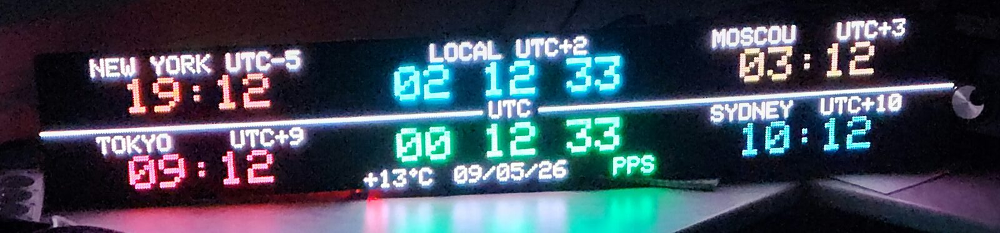
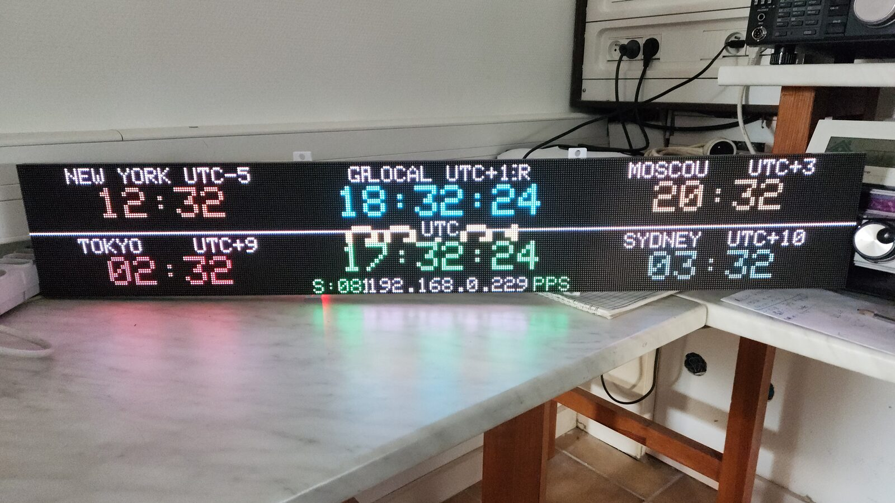
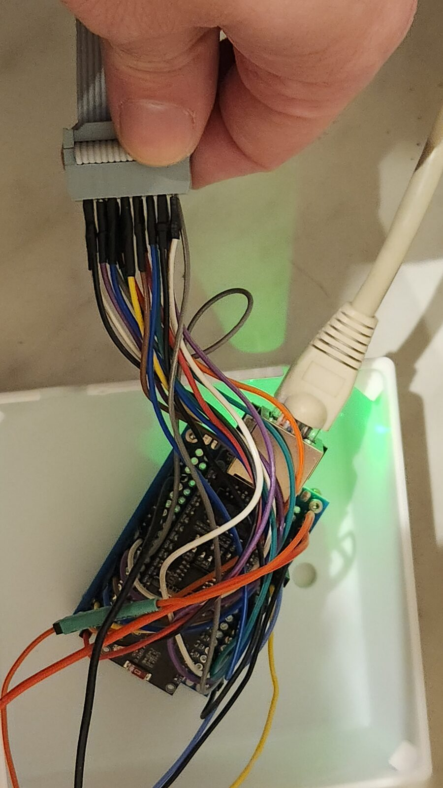
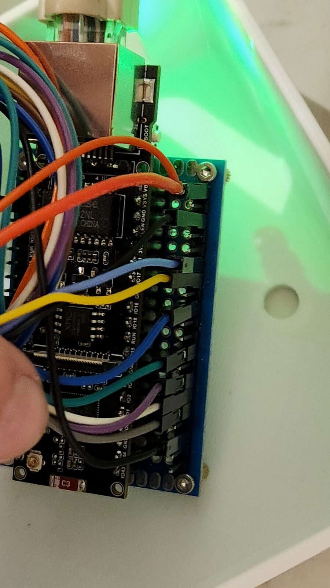
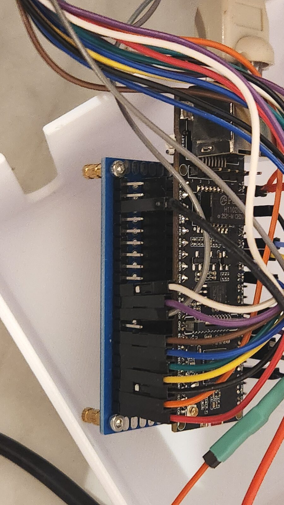

# GPS Clock — Serveur NTP stratum-1 sur ESP32-S3 + matrice HUB75

> 🚧 **Work in progress** — Le projet est fonctionnel sur prototype (câblage volant
> sur fils Dupont). Un **PCB dédié** est en cours de conception et remplacera le
> câblage actuel. Le brochage pourra évoluer en conséquence.

Horloge murale **384×64 px** (3 panneaux LED HUB75 P2.5 de 320×160 mm chacun,
soit 128×64 px par panneau) pilotée par un module GPS et son signal **PPS**, qui 
fait aussi office de **serveur NTP stratum-1** sur le réseau local. Affichage de 
l'heure locale, de l'heure UTC, de quatre fuseaux au choix et de la température 
locale (open-meteo), le tout réglable depuis un tableau de bord web.


> ⚠️ **Pas de WiFi** : la connectivité réseau passe par un module Ethernet W5500.

---

## Fonctionnalités

- **Serveur NTP stratum-1** (port 123) discipliné par le PPS du GPS — précision
  sous la seconde, capture du front PPS par interruption matérielle.
- **Affichage 3 panneaux** : heure locale + UTC au centre, 4 villes du monde sur
  les côtés, date, nombre de satellites, état GPS/PPS.
- **Tableau de bord web** (port 80, responsive) : bascule hiver/été (UTC+1 / +2),
  réglage de la luminosité centre / côtés, choix des 4 villes parmi ~48.
- **Mise à jour OTA** du firmware depuis le navigateur (HTTP Basic Auth).
- **Météo** par géolocalisation GPS via l'API open-meteo (sans clé).
- **Persistance EEPROM** : fuseau, villes et luminosité conservés au redémarrage.
- **Repli IP statique** automatique si le DHCP échoue.

---

## Matériel

| Élément | Détail |
|---|---|
| MCU | ESP32-S3 DevKitC-1 (N16R8 ou équivalent) |
| Affichage | 3 × panneau HUB75 **P2.5** 320×160 mm (**128×64 px** chacun) chaînés — 384×64 px au total, driver FM6126A |
| Réseau | Module Ethernet **W5500** (SPI) |
| Temps | Module GPS avec sortie **PPS** (NMEA 9600 bauds) |
| Alim | 5 V — prévoir l'ampérage pour 3 panneaux (compter ~4 A crête) |

---

## Câblage (prototype actuel — GPIO ESP32-S3)

> 🚧 Brochage du prototype. À adapter le jour où le PCB dédié sera prêt (il suffira
> de modifier le bloc de `#define` en tête de `src/main.cpp`).

### GPS
| Signal | GPIO | Remarque |
|---|---|---|
| RX (← TX du GPS) | 17 | réception NMEA uniquement |
| PPS | 21 | front montant, interruption |

### Ethernet W5500 (SPI)
| Signal | GPIO |
|---|---|
| SCK | 13 |
| MISO | 12 |
| MOSI | 11 |
| CS | 14 |
| RST | 9 |
| INT | 10 |

### Matrice HUB75
| Signal | GPIO | | Signal | GPIO |
|---|---|---|---|---|
| R1 | 1 | | A | 34 |
| G1 | 2 | | B | 35 |
| B1 | 3 | | C | 36 |
| R2 | 15 | | D | 37 |
| G2 | 16 | | E | 38 |
| B2 | 33 | | CLK | 39 |
|  |  | | LAT | 40 |
|  |  | | OE | 41 |

> La broche **E** est nécessaire pour les panneaux 64 lignes (1/32 scan).

---

## Compilation et flash

Le projet utilise [PlatformIO](https://platformio.org/).

```bash
git clone https://github.com/<ton-user>/CLOCK_ESP32_GPS_MATRIX.git
cd CLOCK_ESP32_GPS_MATRIX

# Compiler + flasher
pio run -t upload

# Moniteur série
pio device monitor -b 115200
```

Les dépendances (ESP32-HUB75-MatrixPanel-DMA, Adafruit GFX, Ethernet) sont
déclarées dans `platformio.ini` et récupérées automatiquement.

---

## Configuration

### Identifiants OTA

L'accès à la page de mise à jour OTA (`/ota`) est protégé par une authentification
HTTP Basic. Les identifiants par défaut sont **`admin` / `admin`**, définis en clair
dans `src/main.cpp` :

```cpp
#define OTA_AUTH_B64 "YWRtaW46YWRtaW4="   // admin:admin — À CHANGER en production
```

Pour mettre tes propres identifiants, génère la valeur encodée et remplace-la :

```bash
echo -n 'monuser:monmotdepasse' | base64
```

> ⚠️ **À changer** si l'horloge est exposée sur un réseau non maîtrisé : l'OTA
> permet de flasher le firmware à distance. Le base64 n'est pas du chiffrement,
> juste de l'encodage.

### Autres réglages (en haut de `src/main.cpp`)

- `WARMUP_SECONDS` : durée de l'écran de démarrage avant affichage.
- `UTC_OFFSET_H` : fuseau par défaut (modifiable ensuite depuis le web et
  sauvegardé en EEPROM).
- Adresse MAC Ethernet (`mac[]`) : à personnaliser si plusieurs unités sur le
  même réseau.
- Villes par défaut : tableau `cities[4]`.

---

## Utilisation

1. Au démarrage, l'écran affiche un compte à rebours « WARMUP » le temps de
   l'acquisition GPS et du DHCP. L'IP obtenue s'affiche en bas.
2. Une fois le *fix* GPS obtenu, l'horloge passe en mode normal.
3. **NTP** : pointer tes clients sur l'IP de l'horloge, port 123.
4. **Web** : ouvrir `http://<ip-de-l-horloge>/` pour le tableau de bord,
   `http://<ip-de-l-horloge>/ota` pour la mise à jour firmware.

---

## Galerie

| | |
|---|---|
|  |  |
| *Affichage de nuit* | *Installée à la station* |

### Prototype (câblage provisoire, avant PCB)

| | |
|---|---|
|  |  |
| *Câblage volant des panneaux* | *ESP32-S3 DevKitC-1* |


*Module Ethernet W5500 et carte GPS (connecteur SMA)*

---

## Roadmap

- [ ] PCB dédié (KiCad) regroupant ESP32-S3, W5500 et connecteur GPS
- [ ] Boîtier / support définitif
- [ ] Documentation du brochage final une fois le PCB validé

---

## Licence

Distribué sous licence **MIT** — voir le fichier [LICENSE](LICENSE).
Utilisation, modification et redistribution libres.
